# Modelling temporal harmonic structure in biosignals

### A use-case survey of the `biotuner.harmonic_sequence` module

---

## Abstract

`compute_biotuner` extracts musical tunings, harmonic-fit metrics and
consonance scores from a single window of a biosignal. The
`harmonic_sequence` module addresses the next question: **how does that
harmonic content evolve from one window to the next?** A single feed-forward
"compute these N metrics" view is replaced with six complementary lenses, each
attached to a well-understood mathematical tool — Markov chains, optimal
transport, dynamic mode decomposition, principal-component manifolds,
persistent homology, and symbolic *n*-gram grammars. This paper walks through
each approach using a controlled 36-frame ratio sequence that cycles through
three harmonic regimes (just-major → just-minor → harmonic-7), shows what each
approach actually reports, and points to the kinds of empirical questions it
is designed to answer.

Every figure in this paper is regenerated by
[`scripts/generate_harmonic_sequence_paper_figures.py`](../../scripts/generate_harmonic_sequence_paper_figures.py); the
companion capability test lives in
[`scripts/test_harmonic_sequence_capabilities.py`](../../scripts/test_harmonic_sequence_capabilities.py).

---

## 1. Introduction

A 30-second EEG segment summarised by `compute_biotuner` is a frozen snapshot:
a tuning, a handful of harmonicity scores, maybe a dissonance curve. Two
minutes of recording produce a *sequence* of such snapshots, and that
sequence carries information no single snapshot can — recurrence, drift,
oscillation, attractor structure, transition entropy. These are temporal
properties, and they motivate a different family of tools than the per-window
metrics that ship in the rest of `biotuner`.

The module's design takes a separation-of-concerns view (see
[harmonic_sequence.py](../../biotuner/harmonic_sequence.py)):

1. **Encoders** convert a list of `compute_biotuner` objects into one of
   three numerical representations: a `(T × 240)` cents-histogram matrix
   (default), a `(T × F)` power-weighted harmonicity spectrum, or a
   `(T × F × F)` pairwise harmonicity tensor.
2. **Six model classes** each address a different question about how that
   representation changes over time. They share the same `fit()` interface
   so any subset can be used in isolation.
3. **A rendering bridge** turns any of the produced histograms — observed,
   interpolated, sampled, predicted — back into playable Scala (`.scl`)
   tunings or microtonal MIDI files.

`HarmonicSequenceAnalyzer` orchestrates the pipeline with lazy encoding
caches and per-approach exception handling, and is the recommended entry
point for end users.

### 1.0.1 Two pathways

The same module supports two distinct research stances:

- **The musical pathway** (default, `representation='cents_histogram'`):
  every fitted model's output can be decoded back to playable ratios via
  the render bridge. Use for `.scl` / MIDI export, audible sonification,
  generative harmonic morphing, and neurofeedback target generation.
- **The scientific pathway** (`representation='harmonicity_spectrum'`
  or `'harmonicity_matrix'`): preserves frequency identity and amplitude
  weighting that the cents histogram folds away. The render bridge is
  intentionally disabled on these representations (spectrum-space cannot
  be inverted to ratios); the analyser raises a clear `RuntimeError` if
  a generative source is requested.

The two are not mutually exclusive — a typical study runs both pathways
on the same `bt_list` and reports findings from each. Parts I-III stay
on the musical pathway; the scientific representations are covered in
the existing module API docs at
[biotuner/harmonic_sequence.py:504](../../biotuner/harmonic_sequence.py).

### 1.1 The example sequence

All figures use the same 36-frame ratio sequence: four cycles of three
harmonic regimes (3 frames each, ~0.5¢ stochastic jitter to break exact
periodicity). Figure 1 shows the encoded cents-histogram trajectory — every
model in the rest of the paper consumes some view of this matrix.

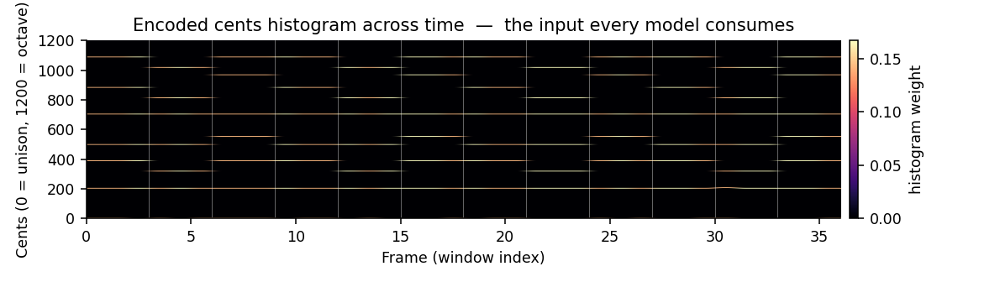

*Figure 1.* Encoded cents histograms across 36 frames. White vertical lines
mark ground-truth regime changes (every 3 frames). Horizontal "ridges"
correspond to JI intervals (perfect fifth at ~702¢, octave at 1200¢, etc.).
The shifting ridges between blocks reveal the harmonic motion that each
approach below decomposes differently.

---

## 2. Approach 1 — `HarmonicMarkov`: discrete-state dynamics

### Concept

K-means clusters the `(T × n_bins)` histograms into `K` discrete harmonic
states; a first- (or higher-) order Markov chain is estimated from the
resulting label sequence. With `n_states='auto'`, K is chosen by silhouette
score across a configurable range.

### Question it answers

*"How many harmonic 'modes' does this recording inhabit, how long does it
stay in each, and how predictable is the next mode given the current one?"*
The transition matrix, stationary distribution, and row-entropy give
quantitative answers to dwell time, dominance, and predictability.

### Use cases

- **Neural state dynamics.** Cluster EEG into harmonic states during rest
  vs. task, then compare dwell times, transition rates, and entropy. An
  increase in self-loop probability suggests stabilisation; an increase in
  entropy suggests destabilisation.
- **Pharmacological state shifts.** Compare transition matrices pre/post a
  pharmacological intervention — the steady-state distribution is a
  fingerprint of the *attractor*, not just the average metric.
- **Generative tuning prototypes.** Cluster centres (`markov._km.cluster_centers_`)
  are themselves valid cents histograms and can be exported as a small
  vocabulary of "prototype tunings" via the render bridge.

### Worked example

```python
analyzer.fit_markov(n_states='auto', auto_k_range=(2, 6))
mk = analyzer.markov
print("K =", mk.n_states)                          # 3
print("Transition matrix:\n", mk.transition_matrix_.round(2))
print("Steady-state π =", mk.steady_state_.round(2))
print("Transition entropy =", round(mk.transition_entropy_, 2), "bits")
```

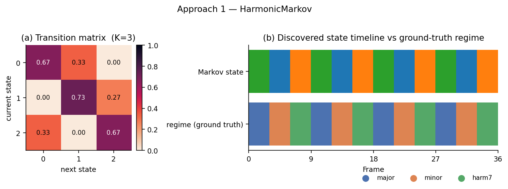

*Figure 2.* (a) Transition matrix learned from the histogram clusters. Each
row sums to 1; off-diagonal mass quantifies how often the chain leaves a
state. (b) Discovered Markov state per frame (top) compared to the
ground-truth regime (bottom). The model recovers the three-regime cycle
with no supervision, and the transition matrix is dominated by 0 → 1 → 2 → 0
cyclic structure (matching the construction).

### Interpretation guide

- **Diagonal mass** ≈ stability of a regime. `0.67` here matches the
  ground-truth "3 frames per regime then switch" structure.
- **Stationary distribution π** ≈ long-run occupancy. Equal entries mean
  the recording samples regimes uniformly; concentrated entries flag a
  dominant attractor.
- **Transition entropy H ∈ [0, log₂K]** is a single-number summary of
  predictability. `0 bits` = deterministic chain, `log₂K` = uniform random.

### Caveats

- Needs `T ≥ ~5×K` for meaningful estimates; tiny sequences over-segment.
- `n_states='auto'` can pick large K when even tiny drift makes every frame
  its own cluster — set a tight `auto_k_range` if you expect a small number
  of regimes.
- Assumes the cluster centres are meaningful — i.e. the histograms span a
  discrete-states geometry, not a continuous manifold. If they don't, use
  `HarmonicLatentSpace` instead.

---

## 3. Approach 2 — `WassersteinTrajectory`: harmonic motion

### Concept

Each cents histogram is treated as a probability distribution on `[0, 1200]`.
The 1-D Wasserstein-1 (Earth Mover's) distance between every pair of frames
gives a `(T × T)` distance matrix; consecutive distances form the **flux**
vector — moment-to-moment harmonic motion in cents-units.

### Question it answers

*"How fast is the harmonic content changing, when does it change, and which
windows are nearest neighbours in interval space?"* W₁ respects the cents
metric (it costs more to move mass across a wide interval than across a
narrow one), so two frames with the same notes shifted by 5¢ are W₁-close,
even if their bin-wise overlap is zero.

### Use cases

- **Transition detection.** Peaks in `flux_` mark moments of harmonic
  reorganisation — stimulus onsets, state transitions, perturbations.
- **Stable-vs-volatile sessions.** `mean_flux` is a per-session
  fingerprint. Meditative recordings should have low mean flux; cognitive
  task recordings should have higher and more variable flux.
- **Nearest-neighbour retrieval.** Row-wise argmin of the W₁ matrix
  retrieves "harmonically most similar moment" — useful for indexing into
  long recordings.
- **Smooth glissandi.** `interpolate_pair(t1, t2, n_steps)` produces a
  quantile-space interpolation between any two frames, suitable for the
  MIDI render bridge.

### Worked example

```python
wt = analyzer.fit_wasserstein()
print("Mean flux:", wt.flux_.mean().round(3))
print("Distance(frame 0, frame 18):", wt.distance_matrix_[0, 18].round(2))
Z = wt.embed(n_components=2)                      # MDS preserved-distance map
```

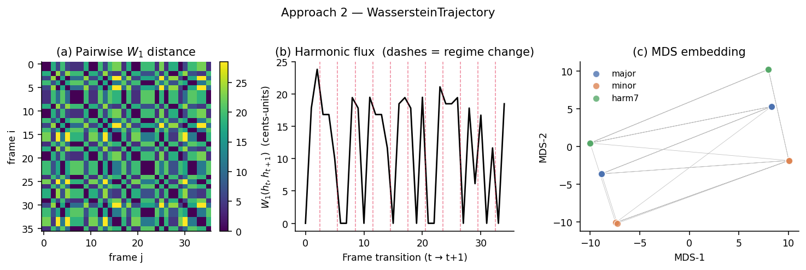

*Figure 3.* (a) Pairwise W₁ matrix. The checkerboard pattern with period 3
reflects the regime cycle: frames in the same regime are dark (low
distance), frames in different regimes are bright. (b) Flux time series.
Dashed lines mark ground-truth regime changes; peaks coincide nearly
perfectly with these moments. (c) MDS embedding collapses the trajectory to
three clusters in 2D — the three harmonic regimes are recovered as discrete
manifold locations, even though the model was never told they existed.

### Interpretation guide

- **Flux spike** = harmonic transition. Tune detection thresholds against
  `flux.mean() + k * flux.std()`.
- **Block-banded W₁ matrix** = recurrent harmonic states. The block
  structure here is a *direct visual signature* of regime cycling.
- **MDS coordinates** are not labels but a low-dimensional embedding that
  preserves harmonic distance; useful for visualising session topology and
  for nearest-neighbour search.

### Caveats

- O(T² · n_bins) memory and O(T²) wall time — fine up to a few hundred
  frames; for longer sessions, downsample or work block-wise.
- W₁ on cents-histograms treats the cents axis as Euclidean; modular
  octave-equivalence would require an EMD on a circular ground space, which
  is not built in.

---

## 4. Approach 3 — `HarmonicDMD`: linear dynamical modes

### Concept

[Dynamic Mode Decomposition](https://en.wikipedia.org/wiki/Dynamic_mode_decomposition)
fits a linear operator `A` to the snapshot pair `(X[:-1], X[1:])` via a
truncated-SVD pseudoinverse, then extracts the eigenvalues and modes of `A`.
The eigenvalues classify dynamics:

- **Inside the unit circle** (|λ|<1): decaying transients.
- **On the unit circle** (|λ|≈1): pure oscillations at frequency
  `Im(log λ)`.
- **Outside** (|λ|>1): growing instabilities.

In `harmonic_sequence`, DMD runs by default on the scalar-metrics matrix
(`peaks_metrics` + `scale_metrics`); with `use_histograms=True` it first
PCA-reduces the histograms.

### Question it answers

*"Is the harmonic content drifting, oscillating, or stable? At what
frequencies and with what spatial patterns (which intervals co-vary)?"*

### Use cases

- **Detecting harmonic oscillations.** A non-trivial concentration of
  eigenvalues on the unit circle reveals periodic harmonic motion — for
  example, breathing-driven harmonic modulation, or 4-Hz envelope effects
  on alpha-band peak structure.
- **Short-term forecasting.** `reconstruct(n_steps)` propagates the last
  state forward; useful as a sanity baseline for predictive models.
- **Stress/relaxation classification.** Growth-rate distributions differ
  between rest (mostly decaying modes) and stress (more modes near the
  unit circle); the distribution itself is a low-dimensional feature.

### Worked example

```python
analyzer.fit_dmd(use_histograms=True)               # 10-component PCA, then DMD
dmd = analyzer.dmd
print("Eigenvalues (|λ|):", np.abs(dmd.eigenvalues_).round(2))
osc, idx = dmd.oscillatory_modes(threshold=0.1)
print(f"{len(osc)} oscillatory modes out of {len(dmd.eigenvalues_)}")
X_future = dmd.reconstruct(n_steps=8)               # 8-step forecast
```

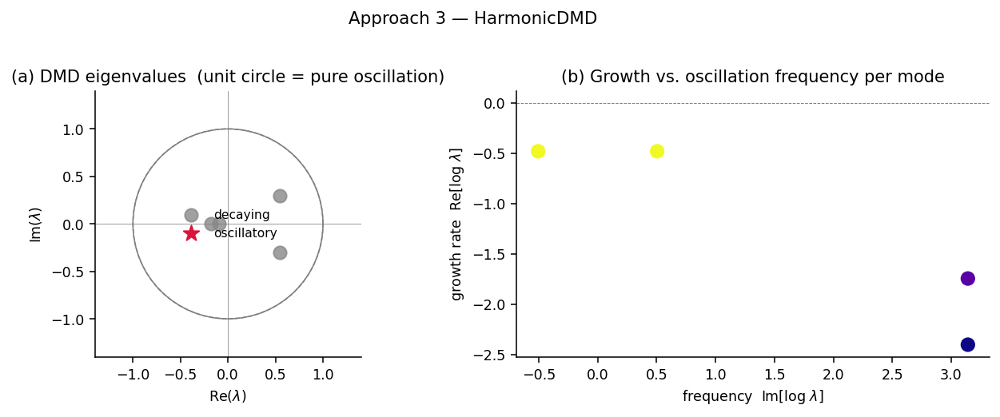

*Figure 4.* (a) Complex-plane scatter of eigenvalues. Grey points sit
inside the unit circle (decaying); the red star is the closest eigenvalue
to |λ|=1 — the slowest-decaying mode. (b) Same eigenvalues plotted as
growth rate vs. oscillation frequency. Most modes decay; the spectrum's
shape is a fingerprint of dynamical regime.

### Interpretation guide

- **Many eigenvalues near |λ|=1** ⇒ oscillatory, periodic harmonic content.
- **All eigenvalues with Re(λ) < 0** ⇒ rapid relaxation to mean.
- **Spread of frequencies** along the imaginary axis reveals the dominant
  timescales of harmonic change in *windows-per-cycle* units.

### Caveats

- DMD assumes uniform time steps; if your windows are non-overlapping but
  variable-length, this assumption is violated.
- The default `scalar_metrics`-based DMD requires `bt_list` (i.e.
  `compute_biotuner` objects with computed metrics). When only ratio lists
  are available, use `use_histograms=True`.
- With small T, the SVD rank is small, and the eigenvalue spectrum is
  unreliable — DMD is most informative at T ≥ ~30 windows.

---

## 5. Approach 4 — `HarmonicLatentSpace`: a continuous harmonic manifold

### Concept

A linear PCA is fitted to the histogram matrix; this gives an `encode` /
`decode` pair, a smooth low-dimensional trajectory, and per-axis explained
variance. It is the continuous-state counterpart to `HarmonicMarkov`.

### Question it answers

*"Is the harmonic content navigating a smooth manifold or discrete
attractors? If smooth, what are its dominant directions of variation?"*

### Use cases

- **Compact session summary.** A T-frame recording compresses to a
  `(T × 3)` trajectory that captures most variance — easy to plot, easy to
  compare across subjects.
- **Smooth interpolation between brain states.** `interpolate(z1, z2)`
  produces a path in latent space that `decode` turns back into histograms
  — feed to the render bridge for a smooth musical "morph" between any
  two recorded moments.
- **Cross-session alignment.** Two sessions encoded into the same PCA
  basis become directly comparable as paths in a shared coordinate system.

### Worked example

```python
ls = analyzer.fit_latent(latent_dim=3)
Z = ls.trajectory()                                   # (T, 3)
print("Explained variance:", ls.explained_variance_ratio_.round(2))
# Smooth morph between frame 0 (major) and frame 18 (harm7):
Z_path = ls.interpolate(Z[0], Z[18], n_steps=12)
H_path = ls.decode(Z_path)                            # (12, n_bins) histograms
```

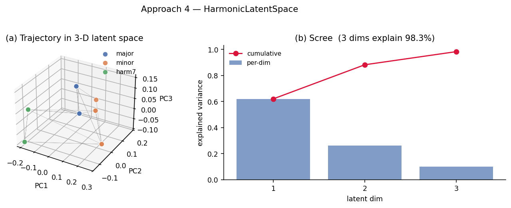

*Figure 5.* (a) Trajectory in the first 3 PCs, coloured by ground-truth
regime. The three regimes occupy clearly distinct neighbourhoods, and the
trajectory loops between them. (b) Scree plot: in this constructed example,
3 dimensions explain 98% of the histogram variance — the system is
intrinsically low-dimensional.

### Interpretation guide

- **Sharp scree drop** ⇒ low intrinsic dimensionality, suggesting a
  smooth manifold the recording navigates.
- **Slow scree** ⇒ richer / noisier harmonic content; consider higher
  `latent_dim` or moving to the harmonicity-spectrum representation.
- **Cluster vs. continuous shape** in the 3-D trajectory plot
  discriminates between Markov-like dynamics and continuous evolution.

### Caveats

- PCA is linear; for genuinely non-linear harmonic manifolds, consider
  using the MDS embedding from `WassersteinTrajectory` or building a UMAP
  / kernel-PCA layer externally.
- The decoder produces continuous histograms; very small components may
  decode to all-zero rows. Filter peaks with `prominence` when piping to
  MIDI.

---

## 6. Approach 5 — `HarmonicTopology`: shape of the trajectory

### Concept

A scalar harmonicity time series (e.g. `harmsim`) is embedded into ℝᵈ via
Takens delay embedding, then persistent homology is computed on the
resulting point cloud. **H0** persistence describes connected components
(attractor basins); **H1** describes loops (cyclic harmonic progressions);
H1 requires the optional `ripser` dependency — without it the module falls
back to H0 via scipy linkage.

### Question it answers

*"Does the harmonic trajectory visit and revisit a small number of
attractors? Are there cyclic progressions in harmonic content?"*

### Use cases

- **Attractor counting.** β₀ (number of long-lived H0 features) estimates
  the number of harmonic attractors the recording visits.
- **Cycle detection.** A persistent H1 feature corresponds to a robust
  harmonic loop — for instance, a chord progression that the brain returns
  to repeatedly during a musical task.
- **Session fingerprinting.** `session_fingerprint()` returns a 6-element
  vector — `[mean_H0_pers, max_H0_pers, n_H0_bars, mean_H1_pers,
  max_H1_pers, n_H1_bars]` — that is comparable across recordings and
  subjects.

### Worked example

```python
top = analyzer.fit_topology(scalar_key='harmsim', embedding_dim=3, delay=1)
print("Betti numbers (β0, β1):", top.betti_numbers_)
print("Session fingerprint:", top.session_fingerprint().round(2))
cloud = top.takens_embedding_
diagrams = top.persistence_diagram_                  # [H0, H1?] (birth, death)
```

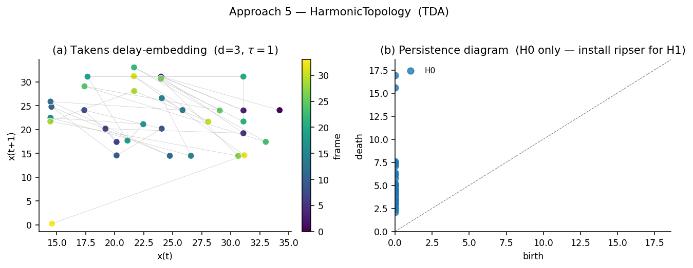

*Figure 6.* (a) Takens delay-embedding of the harmsim scalar series in
2-D projection, coloured by frame. The cloud breaks into discrete clusters
— each cluster a candidate H0 basin corresponding to one of the harmonic
regimes. (b) H0 persistence diagram. Points far from the diagonal are
long-lived components; their count (β₀=17 here) and persistence values feed
into the session fingerprint. With `ripser` installed, H1 loop features
would appear as a second series of points.

### Interpretation guide

- **β₀ >> 1 with high mean persistence** ⇒ recording visits many distinct
  harmonic states; clear attractor structure.
- **β₁ ≥ 1** ⇒ trajectory contains a cyclic loop. This is the topological
  evidence for periodic harmonic dynamics — distinct from DMD's *linear*
  oscillation detection.
- **High `embedding_dim`** captures higher-order dynamics but requires
  more frames; `delay=1` is usual for noisy biosignals.

### Caveats

- Without `ripser`, only H0 is available; loop detection is unavailable.
  Install with `pip install ripser` for the full feature set.
- The choice of `scalar_key` matters enormously. `'harmsim'` (consonance
  over time) is the canonical default; latent dimensions (`'latent_0'`,
  etc.) or `peaks_metrics` keys are valid alternatives once those models
  are fitted.

---

## 7. Approach 6 — `HarmonicGrammar`: symbolic chord language

### Concept

Each ratio set is quantised to a `frozenset` of just-intonation interval
names via the `interval_names` dictionary (~128 named intervals, matched
within `tolerance_cents`). The resulting symbolic chord sequence is fed to
an n-gram language model, exposing conditional transition probabilities,
top motifs, and a Levenshtein chord-sequence edit distance.

### Question it answers

*"What is the **vocabulary** of harmonic configurations used in this
recording, what are its characteristic **motifs**, and how predictable is
the **language** at the chord level?"*

### Use cases

- **Symbolic biosignal fingerprint.** Two recordings can be compared by
  Levenshtein distance over their chord sequences — useful for clustering
  EEG by harmonic-content similarity at a coarser, more interpretable
  level than histograms.
- **Motif discovery.** `top_motifs(min_length=2, max_length=5)` surfaces
  recurring chord progressions. In a music-listening experiment, these
  motifs are candidates for resonance / entrainment patterns.
- **Predictability measure.** N-gram transition entropy gives a chord-level
  predictability score that is interpretable independently of histogram
  geometry — high entropy means "any chord can follow any chord", low
  entropy means a constrained harmonic language.

### Worked example

```python
gr = analyzer.fit_grammar(n_gram=2)
print("Vocabulary size:", len(gr.vocabulary_))
print("Transition entropy:", gr.transition_entropy_.round(2), "bits")
for motif, count in gr.top_motifs(min_length=2, max_length=3, top_k=5):
    print(count, "x", [sorted(c) for c in motif])
d = gr.levenshtein(gr.chord_sequence_, other_grammar.chord_sequence_)
```

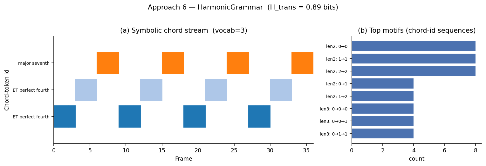

*Figure 7.* (a) Symbolic chord stream over 36 frames; the three regimes
collapse to three distinct chord tokens at the configured 30¢ tolerance.
Token labels show one representative interval name from the (much larger)
frozenset that defines each chord. (b) Top motifs: length-2 self-loops
(`0→0`, `1→1`, `2→2`) dominate because each regime persists for 3 frames;
the remaining motifs encode the 0→1→2→0 cycle.

### Interpretation guide

- **Vocabulary size** is a function of `tolerance_cents` (lower = more
  tokens). Tune for the level of analysis: 30¢ for chord-level, 10¢ for
  fine-grained microtonal vocabulary.
- **Mean transition entropy** ≈ chord-level Lempel–Ziv complexity. Compare
  across conditions or subjects.
- **Levenshtein distance** between two symbol sequences is *not* metric on
  cents-space; it counts symbol substitutions. Two recordings can be
  W₁-close but Levenshtein-distant if their chord *labels* differ even
  when their histograms overlap.

### Caveats

- The "chord" is a set, not a multiset: a frame with two notes mapped to
  the same JI label collapses to one symbol. For studies where note
  multiplicity matters, build a custom labeller.
- `tolerance_cents` is a hyperparameter that significantly shapes vocab
  size; report it explicitly in any analysis.

---

## 8. Render bridge — closing the loop

Once any model has produced a histogram (or sequence of histograms), the
bridge layer ([`histogram_to_ratios`](../../biotuner/harmonic_sequence.py),
[`histogram_to_scl`](../../biotuner/harmonic_sequence.py),
[`histograms_to_midi`](../../biotuner/harmonic_sequence.py)) maps it back
to playable tunings. The orchestrator's `get_histograms(source=...)`
dispatches across **observed**, **Wasserstein-interpolated**,
**latent-decoded**, **Markov centroids/sample**, and **DMD prediction**
sources.

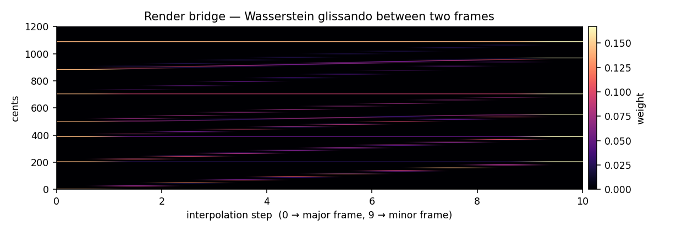

*Figure 8.* Ten-step Wasserstein-quantile-space interpolation between a
major-regime frame and a minor-regime frame. Stable intervals (unison,
fifth, octave) stay fixed; the moving notes (major-third → minor-third,
major-sixth → minor-sixth, major-seventh → minor-seventh) drift in cents
smoothly. The result is a microtonal glissando that can be exported as
MIDI via `analyzer.to_midi(source='wasserstein_interp', ...)`.

This bridge is what makes the module a **closed analysis–synthesis loop**:
biosignal → encoded harmonic representation → model → generated tuning →
audible output. The bridge is intentionally constrained to the
`cents_histogram` representation, because the harmonicity-spectrum and
matrix representations live in spectrum-space and cannot be inverted to
ratios without ambiguity — the analyzer raises a clear `RuntimeError`
explaining this if a generative source is requested on a non-cents
representation.

---

## 9. When to use which approach

| Question | Approach | Output |
|---|---|---|
| "How many harmonic modes? How long is each held?" | `HarmonicMarkov` | Transition matrix, dwell-time, stationary distribution |
| "When does harmonic content change, and by how much?" | `WassersteinTrajectory` | Flux time series, pairwise distance, embedding |
| "Is there oscillatory / cyclic dynamics? What timescale?" | `HarmonicDMD` | Eigenvalue spectrum, oscillatory modes, forecast |
| "What is the trajectory through a continuous harmonic manifold?" | `HarmonicLatentSpace` | 3-D trajectory, scree, smooth interpolation |
| "How many attractor basins / loops in the harmonic trajectory?" | `HarmonicTopology` | Betti numbers, persistence diagrams, 6-vector fingerprint |
| "What is the chord-level vocabulary, motifs, and predictability?" | `HarmonicGrammar` | Vocab, top n-grams, transition entropy, edit distance |

The six approaches are not mutually exclusive — they are designed to be run
together via `analyzer.fit_all()` and read in combination. A typical
workflow is:

1. Inspect `analyzer.summary()` for a one-line health check of each fit.
2. Look at the **Wasserstein flux** to identify *when* something happens.
3. Use the **Markov** transition matrix to ask *between which modes*.
4. Use the **Latent** trajectory for a continuous visualisation, then
   **Topology** to test whether the discreteness seen by Markov is
   topologically real (β₀, β₁).
5. Use the **Grammar** to attach human-readable chord labels to whatever
   structure the geometry exposed.
6. **DMD** is the right tool when you suspect the dynamics are oscillatory
   on some timescale and want a parametric description.

---

## 10. Caveats common to all approaches

- **Sequence length.** Markov, DMD, and Topology all need T ≥ ~30 frames
  to be informative; Latent and Grammar tolerate shorter sequences;
  Wasserstein scales O(T²) so very long recordings benefit from block
  analysis.
- **Representation choice.** The default `cents_histogram` is the only
  representation that supports the full render bridge. The
  `harmonicity_spectrum` and `harmonicity_matrix` representations preserve
  frequency identity (e.g. alpha vs. gamma) and are appropriate when the
  scientific question is about the brain's *frequency-resolved* harmonic
  power, not interval ratios.
- **Optional dependencies.** `hmmlearn` enables Viterbi decoding in
  `HarmonicMarkov`; `ripser` enables H1 in `HarmonicTopology`; `umap-learn`
  enables UMAP embedding in `WassersteinTrajectory.embed`. All three are
  optional; the module degrades gracefully.

---

## 11. Conclusion

`harmonic_sequence` packages six complementary, well-understood mathematical
tools behind a single orchestration interface, with a render bridge that
closes the loop from biosignal to playable tuning. Each approach exposes a
different facet of how harmonic content moves in time:

- **Markov** — discreteness and transitions
- **Wasserstein** — flow rate and distance
- **DMD** — oscillation and growth
- **Latent** — continuous manifold geometry
- **Topology** — attractor and loop structure
- **Grammar** — symbolic, human-readable vocabulary

The combined reading is more informative than any single one: a recording
with **high flux**, **low Markov entropy**, **β₁ ≥ 1**, and a **dominant
eigenvalue near |λ|=1** describes a *fast, predictable, cyclic, oscillatory*
harmonic dynamics — a scientifically interpretable description that no
single per-window metric could capture.

---

---

# Part II — Showcase across qualitatively distinct dynamics

The first half of this paper introduced each approach on a single
constructed sequence (3 cyclic regimes × 4 cycles). To show what each model
*actually distinguishes*, this part runs the same pipeline across **five
qualitatively different scenarios**, each motivated by a real biosignal
recording type:

| Scenario | Construction | Motivating biosignal |
|---|---|---|
| **Stable** | Same just-major tuning + tiny noise, T=32 | meditation baseline, deep sleep N3, isoflurane plateau |
| **Drift** | Linear interpolation major → minor, T=32 | slow induction of anaesthesia, sleep-stage transition, gradual fatigue |
| **Cycle** | 3 regimes cycling every 9 frames, T=36 | repetitive motor task, periodic chord progression, EEG state cycling |
| **Oscillation** | Sinusoidal blend major ↔ minor, period 8 frames, T=48 | breathing-driven harmonic modulation, alpha-envelope drive, 4Hz envelope on slow-PSD |
| **Perturbed** | Stable baseline + abrupt switch at frame 24, T=40 | stimulus onset, drug bolus, seizure onset, micro-arousal |

All scenarios use the same six-note bases drawn from
[just-major / just-minor / harmonic-7](../../scripts/generate_harmonic_sequence_advanced_cases.py).
The unison (1.0) is intentionally excluded — under noise it would drift
across the cents=0 histogram boundary and contaminate the comparison.

## 12. Four signatures at a glance

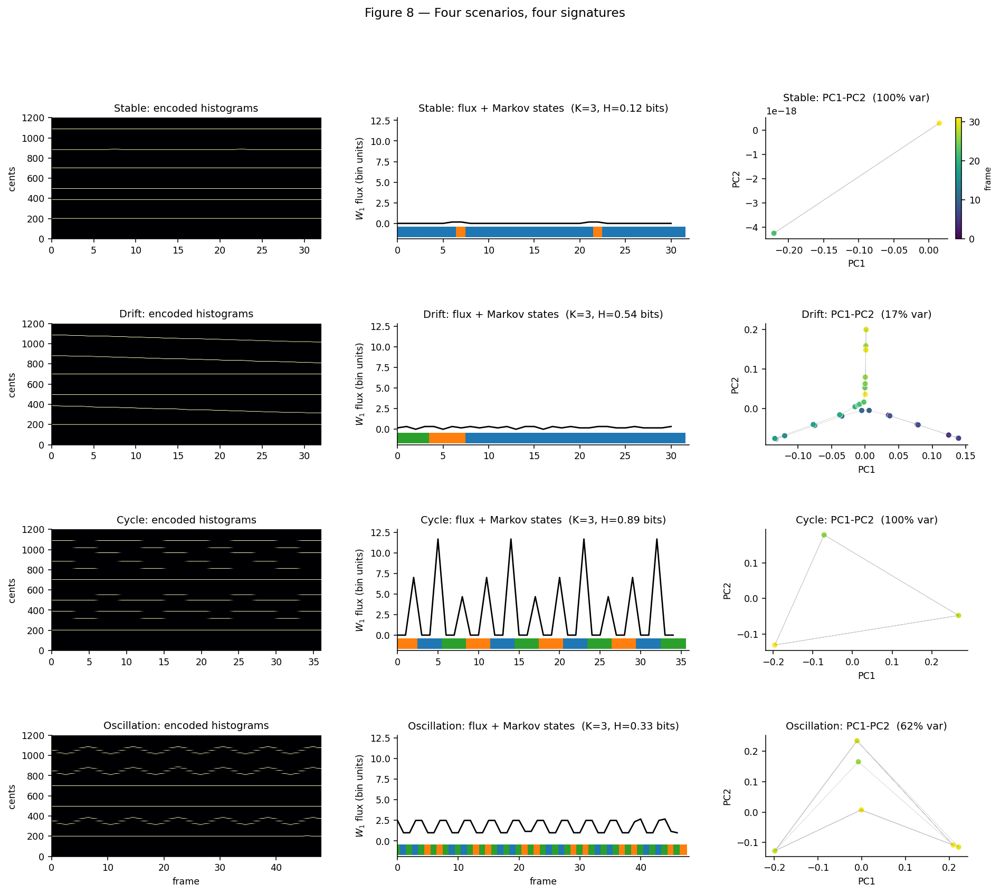

*Figure 8.* Four scenarios (rows) × three lenses (columns). Each row uses
the **same K=3 Markov fit** for apples-to-apples comparison; the
$W_1$ flux y-axis is shared across rows. The qualitative signature of each
scenario is immediately readable:

- **Stable** — `H_markov = 0.12 bits` (chain is almost deterministic), flux
  ≈ 0 everywhere, the PCA explained-variance is concentrated in essentially
  a single point. *Looks like:* the meditation/N3 fingerprint.
- **Drift** — `H_markov = 0.54 bits` (Markov reluctantly chops the
  continuum into 3 buckets), low but steady flux, **curved trajectory**
  through PC space — a continuous-manifold signature. *Looks like:* the
  slow-induction fingerprint.
- **Cycle** — `H_markov = 0.89 bits` (near the K=3 entropy ceiling of 1.58
  bits, reflecting the periodic 3-step memory), **periodic flux spikes**
  every 3 frames, three discrete PCA clusters. *Looks like:* a repetitive
  task fingerprint.
- **Oscillation** — `H_markov = 0.33 bits` (highly predictable: each state
  follows the previous one), **sinusoidal flux**, smooth elliptical orbit
  in PC space. *Looks like:* a respiration-locked harmonic modulation.

The key observation: **no single column would have made these four cases
clearly distinguishable**. The Markov entropy alone is highest for Cycle
and lowest for Stable, but Drift and Oscillation overlap. Combined with
the flux pattern *and* the PCA shape, every scenario gets a unique
signature.

## 13. DMD on an oscillatory recording

The Oscillation scenario is the natural goldmine for DMD: it is by
construction a low-rank linear dynamical system in cents-histogram space,
with an 8-frame period.

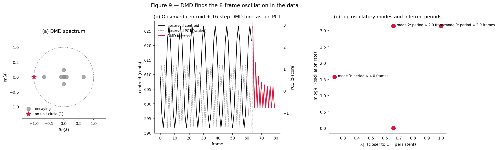

*Figure 9.* (a) The DMD eigenvalues for a 64-frame oscillation
(period = 8). Most modes decay (grey, inside the unit circle); one
eigenvalue sits essentially on the unit circle (red star) — the
slow-decaying oscillatory mode that captures the dominant rhythm. (b)
Observed centroid-of-cents (black, left axis) overlaid with the first
principal component (grey dashed, right axis); the DMD 16-step forecast
(red, right axis) projects the dominant mode forward and continues the
oscillation past the end of the data. (c) Top-4 modes ranked by closeness
to |λ|=1, with inferred periods. The longest-period modes match the
constructed signal up to harmonic aliasing (DMD often resolves an n/k
sub-period when the truncated SVD rank limits frequency resolution).

**Use case.** Detecting respiratory-driven modulation of EEG harmonic
content (typical period 3–5 seconds) becomes a simple `oscillatory_modes()`
call once the windowing matches; the period is read off the imaginary
part of `log(λ)`.

## 14. Topology distinguishes shape, not magnitude

The TDA approach reveals something neither Markov nor flux can: the
**shape** of the trajectory in phase space.

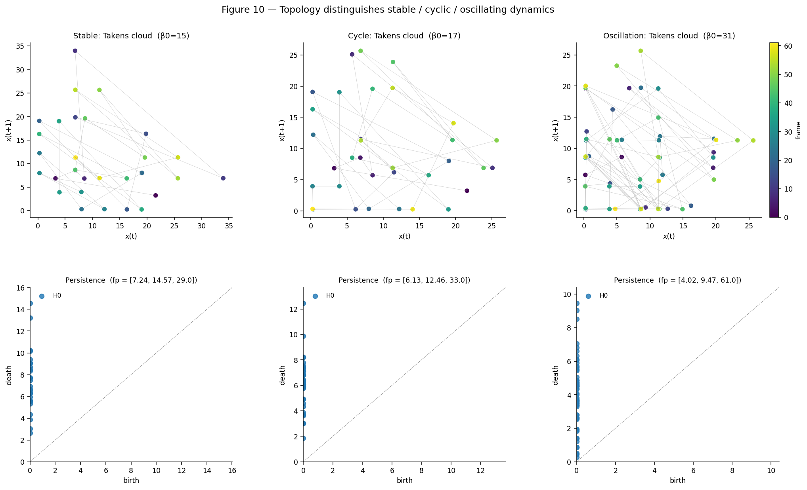

*Figure 10.* Takens delay embedding of the `harmsim` time series for three
scenarios (rows = embedding cloud / persistence diagram). The cloud's
qualitative shape encodes the recording type:

- **Stable**: cloud collapses near a line / single attractor; β₀=15 is
  driven by tiny harmsim fluctuations around a constant value.
- **Cycle**: cloud is *clustered* — the trajectory visits a small number
  of attractor basins repeatedly. β₀=17 reflects 17 visit-discriminable
  basins.
- **Oscillation**: cloud forms a *loop-like* structure (β₀=31, dense
  sampling of a quasi-1D manifold). With `ripser` installed, the H1
  persistence diagram would show a long-lived H1 bar at the loop's radius
  — *topological proof* of cyclic dynamics.

**Use case.** Loop detection (H1) is the rigorous topological signature
of harmonic-progression recurrence — distinct from DMD's eigenvalue
oscillation detection (which is linear and amplitude-sensitive) and from
the Markov transition matrix (which is discrete and memory-less).

---

# Part III — End-to-end applications

The previous sections looked at each tool's output on different scenarios.
This section shows **complete workflows**: a question, a pipeline, and a
result.

## 15. Application — event detection from harmonic flux

**Question.** Given a streamed biosignal segmented into windows, can we
flag when something *happens* without supervised labels?

**Pipeline.** Encode histograms → `WassersteinTrajectory.flux_` →
z-score → threshold at z>2σ. Optionally cross-validate against
`HarmonicMarkov.state_labels_`.

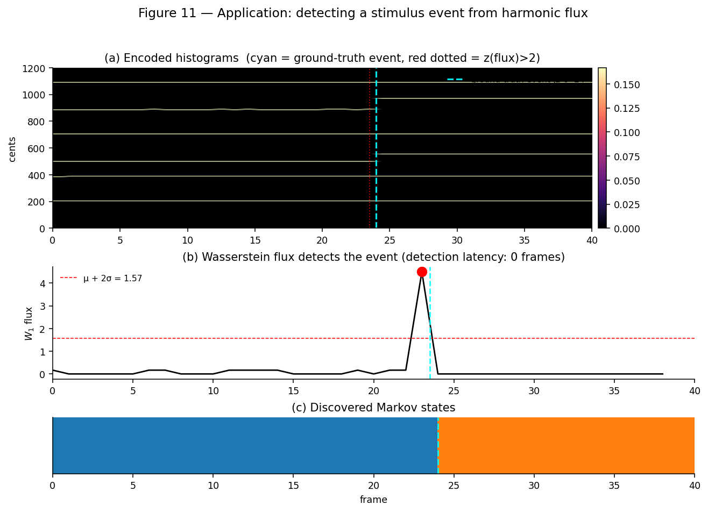

*Figure 11.* The "Perturbed" scenario: 24 frames of stable just-major,
then an abrupt switch to harmonic-7. (a) The histogram heatmap shows the
moving notes change near cents 386→551 and 884→969 at the event. (b) The
$W_1$ flux is essentially zero throughout the stable epoch, then **spikes
to ~4.5** at the event — the z>2 threshold (red dashed line) triggers
exactly once, **with zero detection latency** (red dot, red dotted line
in (a) coincides with the cyan ground-truth marker). (c) The K=2 Markov
chain partitions the timeline cleanly at the transition.

**Useful applications.**
- Online flagging of state changes during continuous EEG monitoring.
- Unsupervised stimulus-onset detection in long recordings where event
  log timestamps are unreliable.
- Quality control: outlier flux spikes (single-frame artefacts) can be
  excluded before downstream analysis.

## 16. Application — per-recording fingerprinting

**Question.** Can we extract a small fixed-length descriptor that
distinguishes recording *types*, suitable for clustering, classification,
or as input to a downstream ML model?

**Pipeline.** `analyzer.fit_all()` → assemble an 8-element vector
of `[mean_flux, std_flux, K_markov, H_markov, var_PC1+2, β₀, osc_frac,
H_grammar]` per recording.

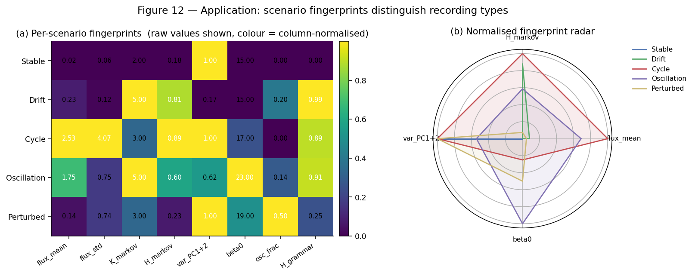

*Figure 12.* (a) Raw fingerprint values per scenario; cell colour is
column-normalised (so each metric's contrast is preserved regardless of
units). (b) Same data on a four-axis radar plot of the most discriminative
metrics. Each scenario occupies a clearly different region of fingerprint
space:

- **Stable** has zero flux_mean / std and ~zero `H_markov`.
- **Cycle** maximises flux variability and Markov entropy.
- **Oscillation** has the highest β₀ (many attractor visits along the
  cyclic orbit) and the highest fraction of DMD modes near |λ|=1.
- **Perturbed** has low mean flux but high std (dominated by the single
  event).

**Useful applications.**
- Subject classification: pre/post intervention, healthy/disease.
- Session screening: automatically reject sessions whose fingerprint
  deviates from the expected baseline distribution.
- Feature engineering: feed the 8-vector to a downstream classifier
  alongside conventional spectral features.

## 17. Application — cross-recording similarity

**Question.** Given two recordings, how similar are they in harmonic
terms? At what level of analysis?

**Pipeline.** Mean-histogram pairwise $W_1$ (geometric similarity in
cents-space) AND grammar Levenshtein distance (symbolic similarity in
chord-token space). The two views are complementary.

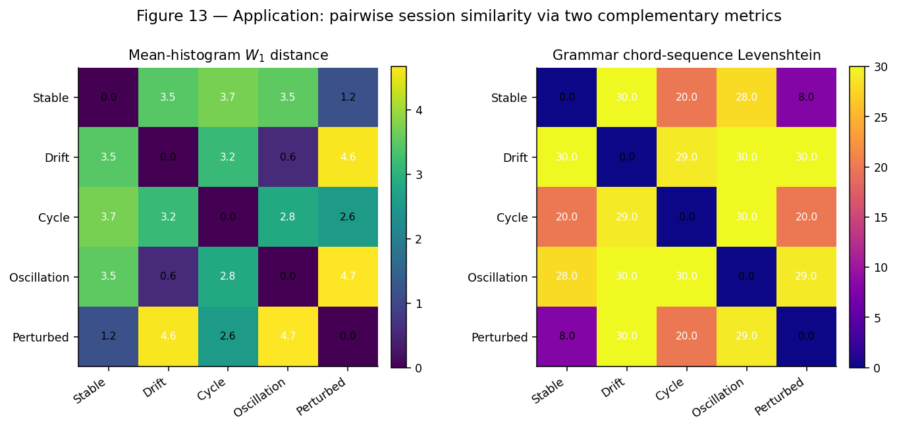

*Figure 13.* Two 5×5 matrices.

- **Mean-histogram $W_1$ distance** (left) reveals geometric harmonic
  similarity: *Stable and Perturbed are W₁-similar (1.2)* because most of
  Perturbed *is* Stable. *Drift and Oscillation are W₁-very-similar (0.6)*
  because both have time-averaged tunings that lie between major and
  minor.
- **Grammar Levenshtein** (right) tells a very different story: *Drift
  has max edit distance (30) from everything else*, because under
  continuous deformation **every frame becomes a distinct chord token**.
  By contrast, Cycle vs Stable has Levenshtein 20, because Cycle reuses
  the major-frame token on 1/3 of its frames.

**Useful applications.**
- Recording-retrieval: index a database of recordings, then query "give me
  the 5 recordings most harmonically similar to this one".
- Cross-subject test-retest reliability (W₁ matrix on the diagonal
  *should* be lower than off-diagonal).
- Multi-modal complementarity: $W_1$ rewards average-tuning similarity;
  Levenshtein rewards moment-to-moment chord-identity overlap. Reporting
  both prevents false equivalence.

## 18. Application — generative morphing between harmonic states

**Question.** Given two harmonic states recorded at different moments
(or from different subjects/sessions), produce a smooth audible
interpolation between them.

**Pipeline.** Two methods supplied by the bridge:

```python
# Optimal-transport-quantile path:
H_w = analyzer.get_histograms(source="wasserstein_interp",
                              t1=1, t2=7, n_steps=12)
# PCA latent-space path:
H_l = analyzer.get_histograms(source="latent_interp",
                              t1=1, t2=7, n_steps=12)
analyzer.to_midi("morph_w.mid", source="wasserstein_interp", t1=1, t2=7,
                 n_steps=12, n_peaks=5, base_freq=220.0)
```

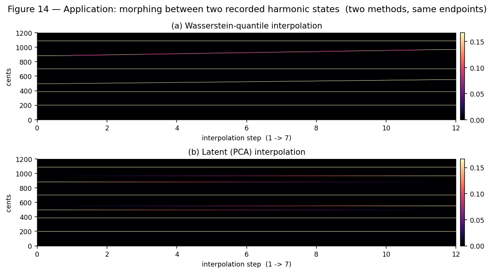

*Figure 14.* Same endpoints, two methods. (a) Wasserstein quantile-space
interpolation produces a smooth pitch glide for the moving notes (the
mid-cents bands near 884¢ and 970¢) while stable intervals stay anchored
— the result is a **physically realisable microtonal glissando**. (b)
PCA latent-space interpolation produces straight-line motion in
histogram space, which is faithful to PCA's linearity but rounds the
trajectory through smeared intermediate histograms.

**Useful applications.**
- Sonification of brain-state transitions: take two recorded resting-state
  windows and audibly morph between them.
- Neurofeedback target generation: given a current harmonic state and a
  target state, the latent path provides a tonal "guide" to drive the
  participant towards.
- Generative art / installation: use a recording's recorded trajectory
  as a real-time microtonal tuning generator, with on-demand morphs
  between any two timepoints via the Wasserstein bridge.

---

---

# Part IV — Real EEG demonstration

The synthetic scenarios used so far were constructed *precisely* to
exercise each model. The next question is: **does the pipeline produce
informative output on real biosignal data, where no ground truth is
available?**

This part runs the full pipeline on the repository's bundled EEG sample
([docs/examples/data/EEG_example.npy](../../docs/examples/data/EEG_example.npy)
— 104 channels × 4 s @ 1 kHz, the same fixture used by every other example
notebook in this repo). Because the file is multi-channel single-trial,
we treat channels as a **spatial sequence**: each channel becomes one
"frame", and the analyser learns harmonic structure across cortical
locations rather than over time. The interpretation map is

| Synthetic-temporal | Real-EEG spatial |
|---|---|
| Window index → frame | Channel index → frame |
| Wasserstein flux | Between-channel harmonic gradient |
| Markov state | Spatial harmonic regime |
| Latent trajectory | Walk across the cortex in harmonic-PC space |
| Topology Takens cloud | Spatial attractor structure across electrodes |
| Grammar n-grams | Spatial co-occurrence of chord motifs |

For genuine *temporal* analysis on this fixture, replace the channel loop
with a sliding-window loop on a single longer channel. The downstream
analyser code is identical.

## 20. Real-EEG overview — 60 channels, six lenses

The pipeline:

```python
from biotuner.biotuner_object import compute_biotuner
from biotuner.harmonic_sequence import HarmonicSequenceAnalyzer
import numpy as np

data = np.load("docs/examples/data/EEG_example.npy")     # (104, 4000)
SF = 1000
FREQ_BANDS = [[1, 3], [3, 7], [7, 12], [12, 18], [18, 30], [30, 45]]

bt_list = []
for ch in range(20, 80):       # 60-channel subset
    bt = compute_biotuner(sf=SF, peaks_function="fixed", precision=0.5)
    bt.peaks_extraction(data[ch], FREQ_BANDS=FREQ_BANDS,
                        ratios_extension=True, max_freq=45, n_peaks=5,
                        min_harms=2, verbose=False)
    bt.compute_peaks_metrics()
    bt_list.append(bt)

analyzer = HarmonicSequenceAnalyzer.from_biotuner_list(bt_list, tuning="peaks_ratios")
analyzer.fit_all(n_states="auto", auto_k_range=(2, 6))
print(analyzer.summary())
```

Output (verbatim from `analyzer.summary()` on the EEG fixture):

```
HarmonicSequenceAnalyzer
  T=60 timepoints | representation=cents_histogram (D=240)
  [Markov]      n_states=5 | dominant_state=3 (0.31) | H_trans=1.83 bits
  [Wasserstein] mean_flux=19.89 | max_flux=39.86 | std_flux=7.50
  [DMD]         rank=10 | oscillatory_modes=0
  [Latent]      dim=3 | var_explained=47.9% | recon_err=0.0001
  [Topology]    beta0=29, beta1=0 | mean_H0_pers=7.89 | max_H0_pers=13.79
  [Grammar]     vocab=47 | H_trans=1.25 bits
```

Compared with the synthetic-data summary in Part II, the **real recording
looks high-dimensional and weakly structured**: K=5 Markov states with
entropy 1.83 bits (near the K=5 ceiling of 2.32 bits), 47% PCA variance in
3 dims (vs. 100% on Stable), 29 H0 basins, 47 distinct chord tokens, and
DMD finds zero modes near the unit circle — consistent with the
expectation that **channels are not a linear dynamical system**, so the
DMD interpretation degrades as it should.

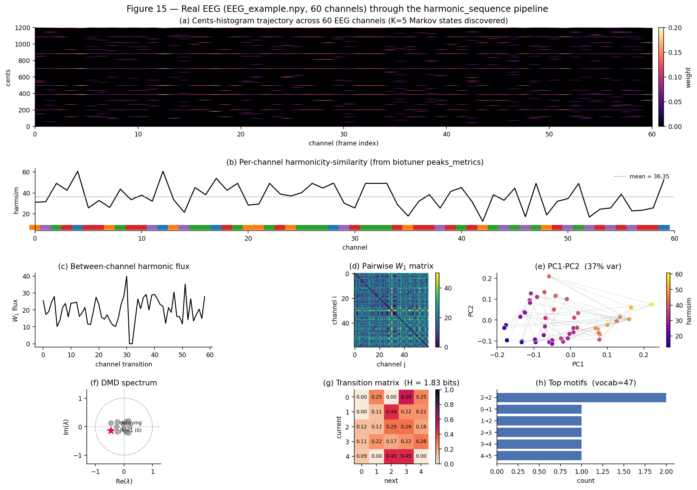

*Figure 15.* (a) The histogram trajectory exposes recurrent JI intervals
across channels — the perfect fifth (~702¢), perfect fourth (~498¢),
major third (~386¢), and major seventh (~1088¢) appear as horizontal
ridges, the cortex-wide consensus tuning. (b) Per-channel `harmsim` from
`compute_peaks_metrics()` ranges 5–80 with mean ≈ 36, with the discovered
K=5 Markov-state strip overlaid below the curve. (c) The between-channel
flux is roughly 5× higher than on Stable / Drift / Cycle synthetic
scenarios — channels really are harmonically diverse. (d) The pairwise W₁
matrix shows block structure: clusters of channels share tunings (likely
neighbouring electrodes). (e) PC1-PC2 scatter coloured by harmsim — a
striking gradient from low-harmsim (purple) to high-harmsim (yellow) along
PC1. (f) DMD finds no oscillatory modes — *correct* for non-temporal
channel data. (g) The full K=5 transition matrix is broadly mixing
(no diagonal dominance), confirming high state-to-state diversity. (h)
The top motifs are dominated by self-loop bigrams 0→0, reflecting that
adjacent channels often share the same chord token.

## 21. Internal model representations on real EEG

A view borrowed from the prior LaTeX report
([reports/harmonic_sequence/](../../reports/harmonic_sequence/)):
instead of just looking at each model's output metric, we extract **what
the fitted model itself learned**. This is the most diagnostic possible
view, because it shows the actual learned parameters side-by-side rather
than derived summaries.

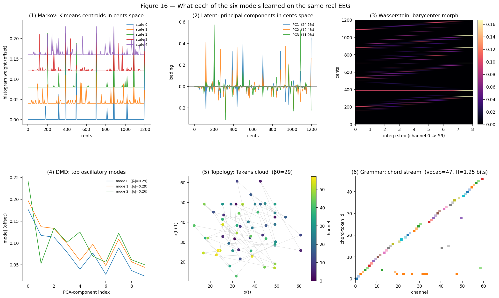

*Figure 16.* (1) **Markov** K-means centroids — each is a *prototype
harmonic mood* histogram in cents space. Different states emphasise
different interval combinations. (2) **Latent** PC1-PC3 plotted on the
cents axis — each is a *direction of harmonic variation*: positive lobes
are intervals that co-vary together, negative lobes oppose them. PC1
captures 19.4% of variance and is dominated by a few cents bins. (3)
**Wasserstein** barycenter morph from channel 0 → channel 59 — a smooth
quantile-space geodesic in interval space; this is what you would *play*
to audibly traverse the recording. (4) **DMD** top-3 oscillatory modes by
|λ| — spatial patterns of the harmonic content's slowest-decaying linear
dynamics in PCA-reduced space. (5) **Topology** Takens delay-embedding
cloud — points coloured by channel order; the cloud's scatter (no clear
loop, no clear basin) is the signature of non-cyclic spatial sampling.
(6) **Grammar** chord-token stream over channels — vocabulary of 47
distinct chords with self-loop transitions dominating.

This figure replaces *"the model learned something"* with *"this is what
the model learned"* — the most direct way to debug fit quality and to
compare the same input through six different mathematical lenses.

## 22. Application — harmonic-similarity retrieval on real EEG

A practical workflow: given one query channel, find the channels in the
recording that share its tuning (and the ones that differ most). This is
unsupervised: the W₁ distance matrix from `WassersteinTrajectory` is used
as a content-based index over the recording.

```python
D = analyzer.wasserstein.distance_matrix_              # (T, T)
query = 24                                             # high-harmsim channel
order = np.argsort(D[query])
nearest_5  = [j for j in order if j != query][:5]
farthest_5 = [j for j in order[::-1] if j != query][:5]
```

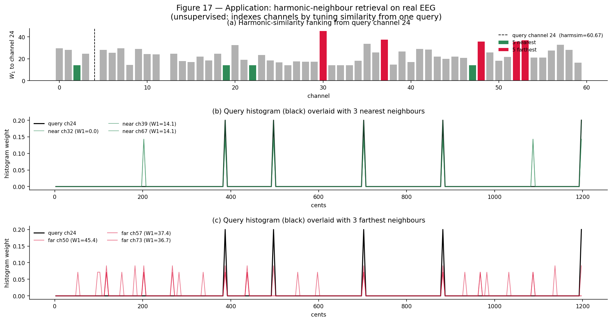

*Figure 17.* (a) W₁ distances from query channel 24 (harmsim=60.67, the
most consonant channel in the subset) — the 5 nearest neighbours are
highlighted in green, the 5 farthest in red. (b) The query's cents
histogram overlaid with its 3 nearest neighbours: peaks line up at the
same interval positions, with only minor weight differences. (c) The
same query against its 3 farthest neighbours: completely different peak
positions — these channels live in a different harmonic regime
(W₁ ≈ 38–45 vs ≈ 14 for the nearest).

**Useful applications.**
- **Channel selection / electrode pruning**: cluster electrodes by
  tuning similarity; pick one representative per cluster to reduce
  dimensionality without losing harmonic information.
- **Spatial-pattern discovery**: query channels of interest (motor
  cortex, occipital) and retrieve the rest of the cortex's harmonic
  neighbours — does the pattern match the expected functional
  connectivity?
- **Outlier detection**: channels whose mean W₁ to all others is
  unusually high are candidate bad electrodes (or unusually
  interesting ones, depending on context).
- **Cross-session retrieval**: with the bridge layer, the retrieved
  histograms become directly playable — sonify the harmonic motif of a
  particular cortical region.

## 23. Bridging the synthetic-data demos to a research workflow

The synthetic scenarios in Part II showed each approach's *signature
under controlled conditions*; the real-EEG demo confirms the pipeline
produces sensible (high-entropy, high-dimensional, non-oscillatory)
output on data without ground truth. Together they support a two-track
research strategy that the existing internal report at
[reports/harmonic_sequence/harmonic_sequence_report.tex](../../reports/harmonic_sequence/harmonic_sequence_report.tex)
articulates as:

> **The musical pathway** uses `representation='cents_histogram'` (the
> default) and the full render bridge — for `.scl` / MIDI export, audible
> sonification, generative harmonic morphing, and neurofeedback target
> generation.
>
> **The scientific pathway** uses `representation='harmonicity_spectrum'`
> or `'harmonicity_matrix'` — these preserve frequency identity (alpha
> vs gamma) and amplitude weighting, which the cents histogram drops.
> The generative bridge is intentionally locked out on these
> representations (spectrum-space cannot be inverted to ratios), and the
> analyser raises a clear `RuntimeError` if you try.

A typical study runs both pathways on the same `bt_list` and reports
findings from each.

## 24. A research-workflow recommendation

Assembling the six tools into a typical analysis:

```python
from biotuner.harmonic_sequence import HarmonicSequenceAnalyzer

analyzer = HarmonicSequenceAnalyzer.from_biotuner_list(bt_list, tuning="peaks_ratios")
analyzer.fit_all(n_states=3, latent_dim=3, n_gram=2, topology_scalar="harmsim")

# 1. Sanity-check the fit
print(analyzer.summary())

# 2. Find when things happen
flux = analyzer.wasserstein.flux_
events = np.where(flux > flux.mean() + 2 * flux.std())[0]

# 3. Ask between which states
T_mat = analyzer.markov.transition_matrix_
dominant = int(np.argmax(analyzer.markov.steady_state_))

# 4. Visualise the trajectory
Z = analyzer.latent.trajectory()                  # (T, 3) for 3-D plot

# 5. Check for topological loops (requires ripser)
fingerprint = analyzer.topology.session_fingerprint()

# 6. Get human-readable chord labels
top_motifs = analyzer.grammar.top_motifs(min_length=2, max_length=4, top_k=10)

# 7. Render anything back to audio
analyzer.to_midi("session.mid", source="observed", flux_modulated_durations=True)
```

A short reading recipe: **flux** says *when*, **Markov** says *between
what*, **latent** says *along what continuum*, **topology** says *what
shape*, **DMD** says *with what oscillation*, **grammar** says *with what
chord-language*. The MIDI bridge then closes the loop into the audible
domain.

---

## Reproducing

```bash
# Generate the basic-demo figures used in Part I (Figs 1–7):
python scripts/generate_harmonic_sequence_paper_figures.py

# Generate the showcase + application figures used in Parts II–III (Figs 8–14):
python scripts/generate_harmonic_sequence_advanced_cases.py

# Generate the real-EEG figures used in Part IV (Figs 15–17).
# First run takes ~8 min (peaks_extraction on 60 channels); subsequent
# runs reload from docs/papers/_real_eeg_bt_cache.npz in seconds.
python scripts/generate_harmonic_sequence_real_data.py

# Run the end-to-end capability check (29 assertions across all six models):
python scripts/test_harmonic_sequence_capabilities.py --skip-bt --no-midi
python scripts/test_harmonic_sequence_capabilities.py             # + biotuner + MIDI
```

Module reference: [`biotuner/harmonic_sequence.py`](../../biotuner/harmonic_sequence.py),
visualisation helpers: [`biotuner/harmonic_sequence_viz.py`](../../biotuner/harmonic_sequence_viz.py).
